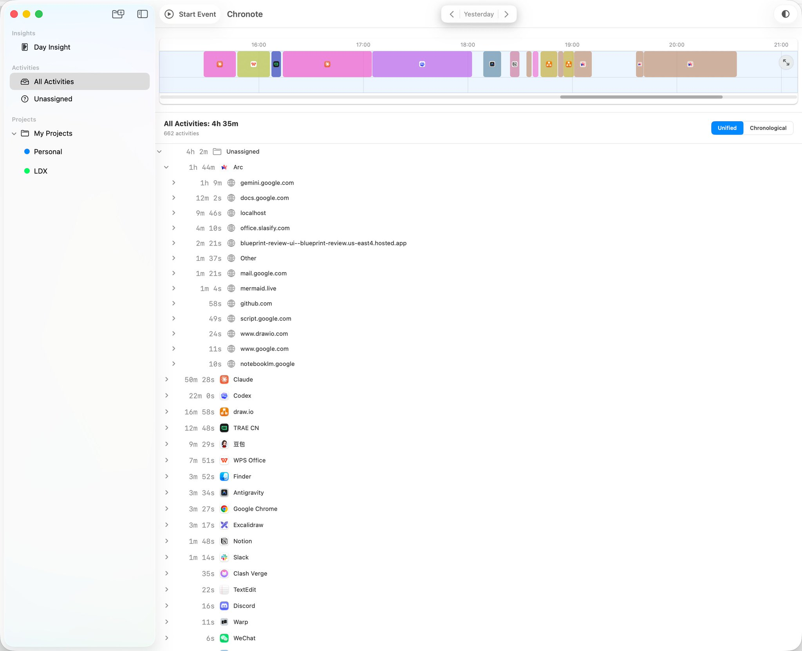
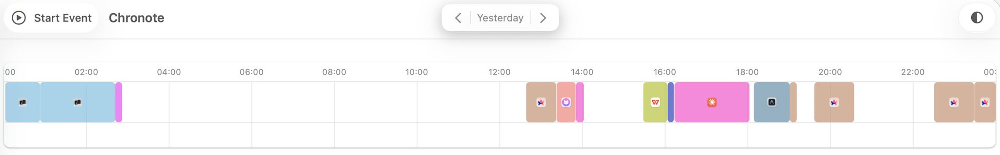
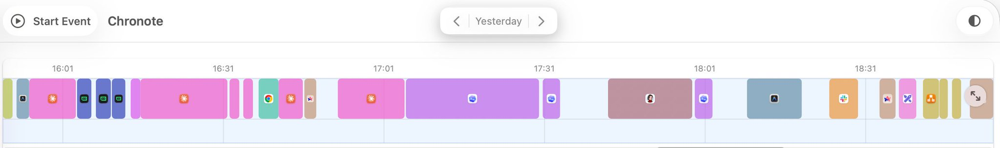

Redesigned how Chronote’s timeline is rendered. It now determines the merging intervals for app activities according to the magnitude of the time range, aligning with natural human intuition—larger ranges require a higher level of abstraction.

