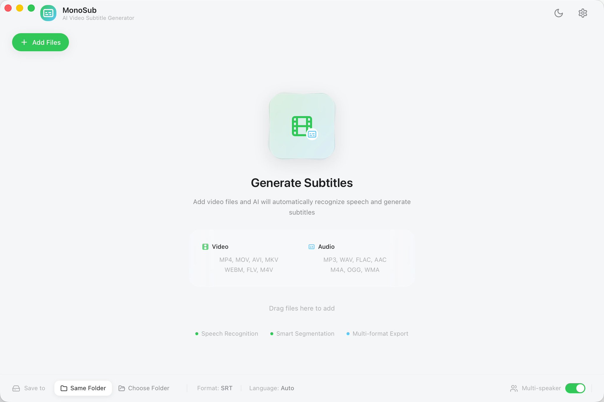

LLMs can only understand text. Therefore, a tool is needed to convert video/autdio into text format. If you don't want to upload your files to cloud services and pay a monthly subscription fee, the macOS app #monosub that I made might be the tool you're looking for.

