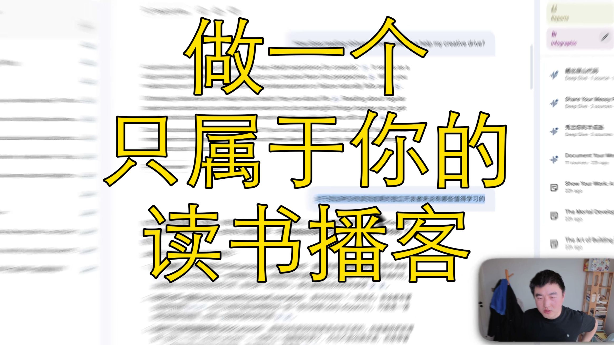

[视频] 凡人开发传：如何做一个个性化播客 
【一句话价值总结】 分享如何基于个人需求制作个性化播客，从为什么做到怎么做，再到未来规划。 【核心要点】 • 解决没时间读书的痛点，将书籍拆解为播客内容 • 基于个人上下文定制内容，实现因材施教 • 使用Notebook LM生成音频内容 • 解决AI生成内容的黑盒问题 • 未来计划开发本地应用，实现book to podcast功能 【结构化时间轴】 00:00-03:35 为什么做播客：解决读书时间不足的问题 03:35-12:40 怎么做播客：使用Notebook LM生成音频 12:40-14 

