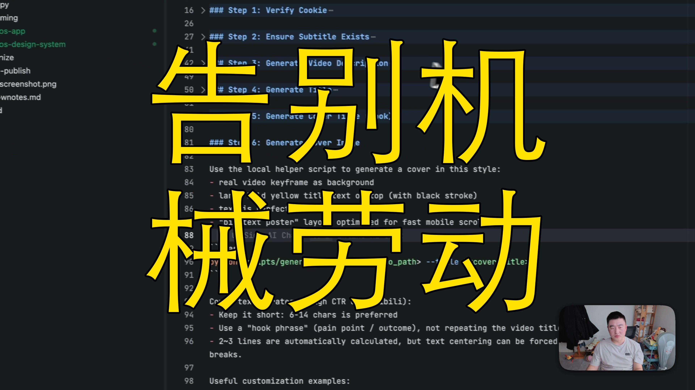

[视频] 我把所有机械劳动都交给了AI！深度拆解我的全自动化技能库 
【一句话价值总结】 本视频深入拆解了作者个人构建的一系列AI自动化“技能”（Skills/SQ），展示了如何通过Agent能力实现内容创作、发布及UI设计的全流程自动化。 【核心要点】 • 介绍了bilibili-upload、monosub、agent-browser等核心自动化工具链。 • 演示了如何利用AI自动生成视频转录、Show Notes、标题及大字报风格封面。 • 分享了针对小宇宙（播客）和社交媒体的内容分发自动化方案。 • 讲解了产品命名（Naming）及UI设计原则在AI技能中的落地经 

