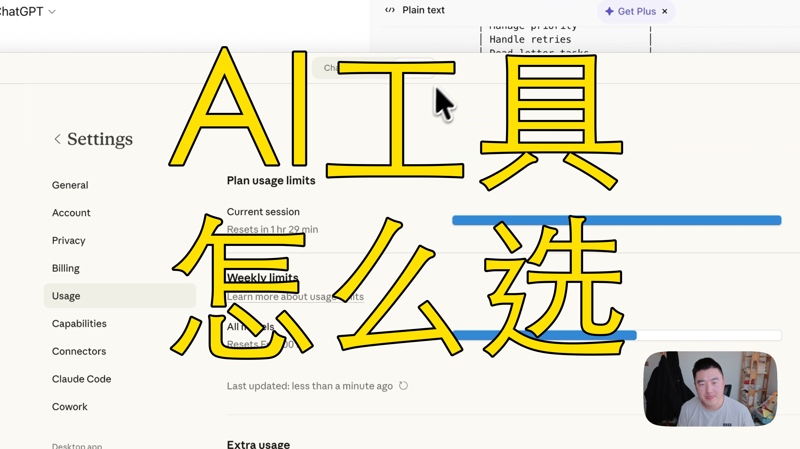

[视频] Claude太贵？我用这套AI组合拳省下80%成本 
【一句话价值总结】 分享我实际使用 Claude、Gemini、Trae 等不同 AI Agent 的策略与分工，帮你根据项目需求选择最合适的工具。 【核心要点（5-8条）】 • Claude (o3/o4.6)：编程能力最强，适合架构设计和复杂任务，但成本高、生成慢 • Claude Code X：生成稳定但速度慢，适合 Claude 额度用完后的备选 • Gemini Pro：性价比高，是我目前的主力执行工具，便宜且额度大 • Trae (国内版)：免费但模型能力有限，适合明确上下文的简单任务 • 

