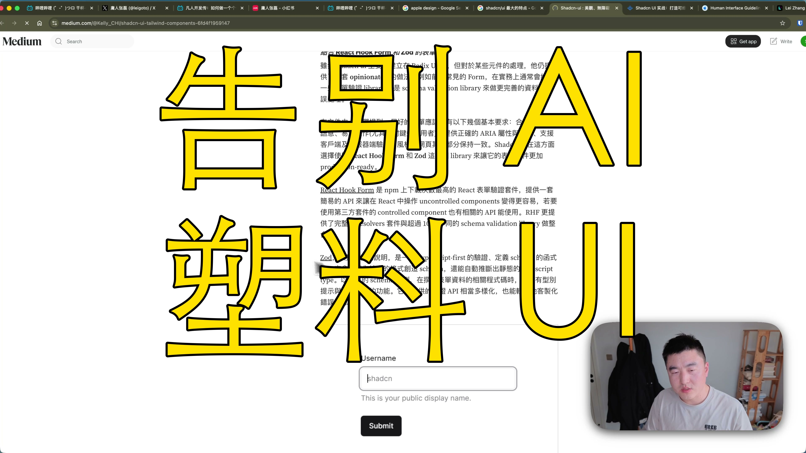

[视频] 告别塑料感！五层架构带你搞定AI时代的高级感UI设计 
【一句话价值总结】 还在忍受 AI 生成的“塑料感”UI？手把手带你建立一套 macOS 级别的 Vibecoding 设计体系，让你的产品瞬间拥有苹果原生的精致感。 【核心要点（5-8条）】 • 底层逻辑剖析：为什么 80% 的 AI 生成设计都奇丑无比？ • 五层进阶体系：从设计原则（HIG）到原子 Token 的系统化重构。 • Vibecoding 满分答案：深度解析 Shadcn UI 与 EinUI 的液态玻璃美学。 • 实战演练：避开“直接生代码”的坑，建立可复用的组件库思维。 • 设计服 

