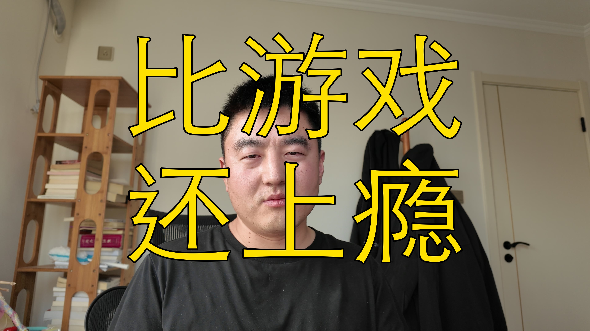

[视频] Vibe coding 让我戒掉了游戏，但它本身比游戏还上瘾 
【一句话价值总结】 Vibe coding 有多上瘾？我拆解了让人停不下来的 4 层心理机制，以及我为什么决定要主动克制。 【核心要点】 • 及时反馈：AI 3-4 秒出结果，和游戏多巴胺刺激一模一样，我因此基本戒掉了打游戏 • 创造感：像小孩搭积木，持续感受到我在创造东西的满足 • 指挥快感：现实中没有团队，AI 给了你当老板发号施令的虚假幻觉 • 妄念加持：等我把这个做成功了…——这种幻想像无形的 PUA 推着你不停搞 • 多项目并行的副作用：同时开好几个项目，脑子全乱，身心俱疲 • 警报信号：作息 

