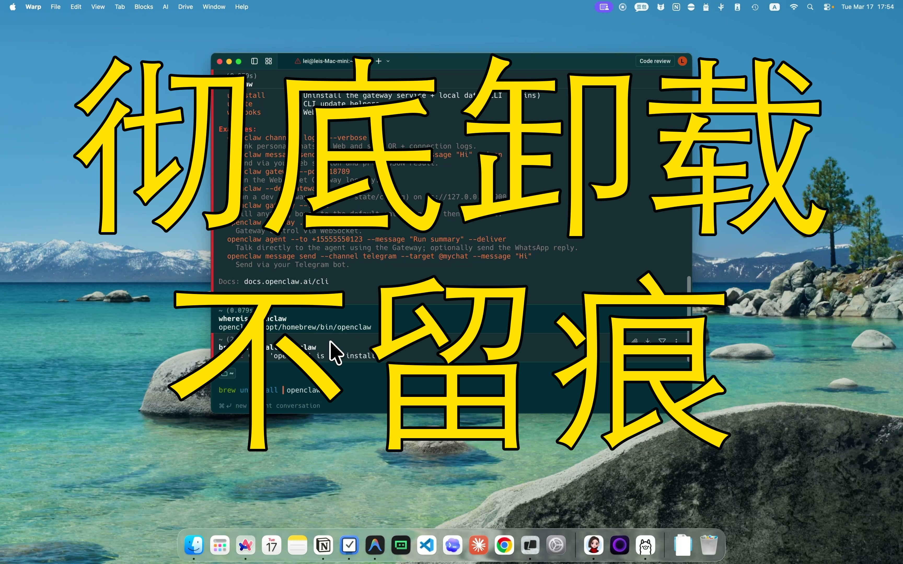

[视频] OpenClaw卸载不完全？教你彻底清理不留残留 
【一句话价值总结】 完整演示 OpenClaw 的卸载流程，包括 CLI 工具、配置文件和数据目录的彻底清理，避免残留占用空间。 【核心要点（5-8条）】 • 使用 npm/pnpm uninstall -g 卸载全局安装的 openclaw 包 • 通过 Homebrew uninstall 删除 brew 安装的版本 • 删除 /usr/local/bin 下的软链接指向 • 清理 ~/.openclaw 目录（包含历史记录、认证、memory、workspace） • 删除 /usr/local/ 

