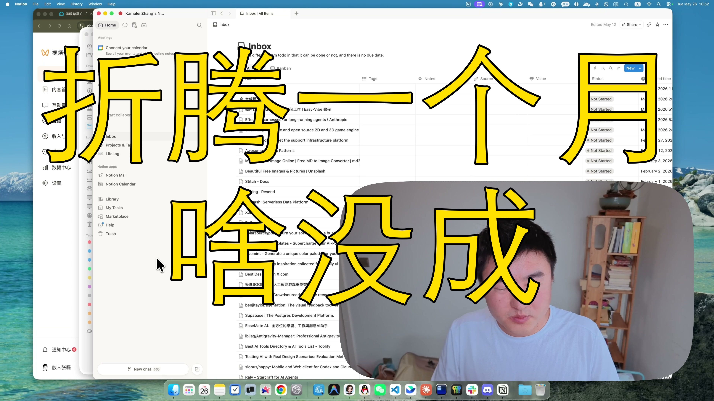

[视频] 五月复盘：公众号带货赚了十几块、TTS播客失败、多个项目死透了 
【一句话价值总结】 一个远程程序员的五月真实复盘：公众号带货尝试、TTS播客失败、知识管理折腾，以及"不卷"之后的现实落地。 【核心要点】 • 公众号+视频号变现尝试：炮制AI内容带货，十几块流量费，诚实复盘踩坑过程 • TTS播客项目失败：天元模型音质极差，工程复杂度估低，决定放弃 • 本地知识管理回归：放弃Notion，用本地文件系统+自制同步工具管理个人知识库 • Photo Picker小工具：AI批量帮你选照片，已做出但功能太垂直仅自用 • 英语学习困境：读课文法不适合，尝试先背词再背对话的两 

