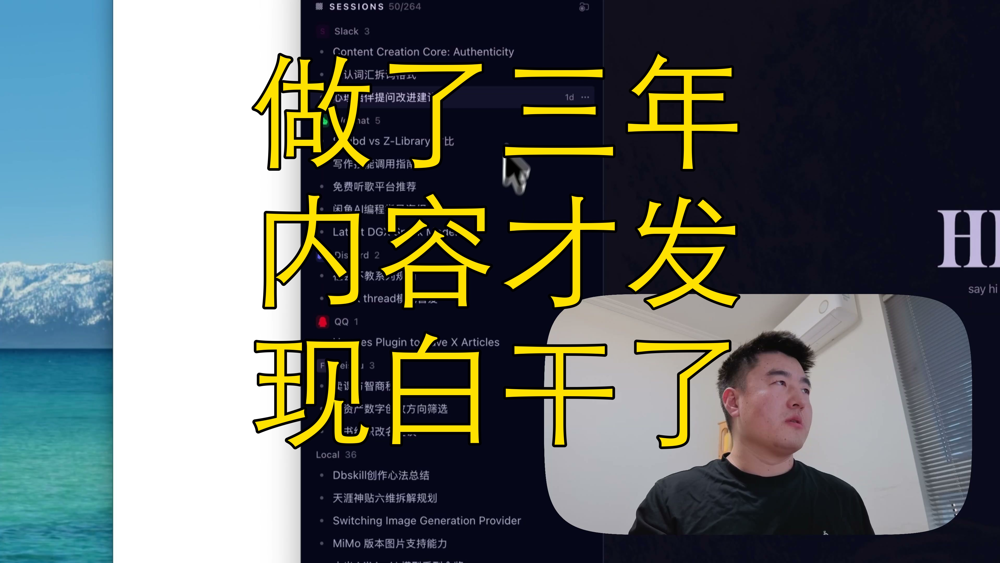

[视频] 搞内容创作才发现：所有创作都该围绕卖货 
【一句话价值总结】 深度记录了独立开发者如何通过Hermes Agent构建个人AI助理的全过程，并反思了内容创作与个人产品化的核心逻辑——工具是手段，围绕人的需求创作稀缺内容才是可持续路径。 【核心要点】 • Hermes Agent的核心优势在于数据主权，用户可自主掌控消息、记忆与技能配置，区别于Codex等纯编程工具 • 其内存系统包含messages、skills、honcho多层抽象，通过持续提炼形成"身份卡"，模拟人类记忆的归纳过程 • 模型配置实战：从Ollama本地部署转向NVIDIA 

