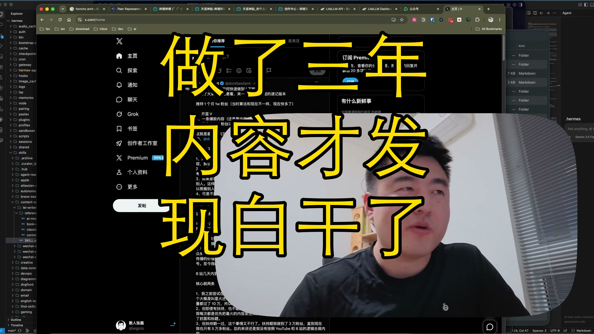

[视频] 搞内容创作才发现：所有创作都该围绕卖货 
【一句话价值总结】 一个程序员从"看不起内容创作"到"发现内容就是围绕卖货"的认知转变过程，附带 Hermes Agent 本地记忆系统的实操体验。 【核心要点】 • 内容创作的本质是围绕产品卖货，不是自嗨 • 微信公众号靠推流而非粉丝，一天可发多篇 • 1000赞几块钱，100阅读几块钱，流量主收益有限 • 闲鱼上架AI编程陪跑服务，46浏览0成交——信任问题难解 • 会用AI的人不需要你，不会用AI的人找不到你 • Hermes Agent 本地部署 Honcho 记忆系统的折腾经历 • AI不需要 

