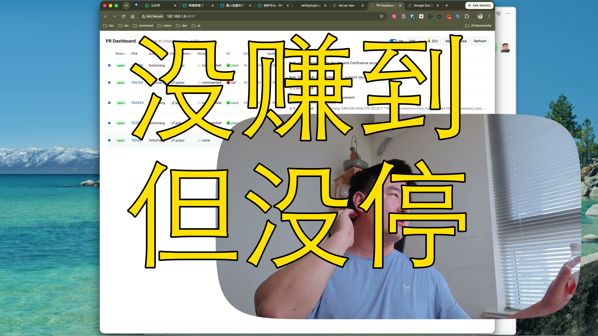

[视频] 公众号没赚到钱 短视频字幕还没搞好 但我不打算停 
【一句话价值总结】 情绪低落时对一切的判断都会偏低，但越是这种时候越要认清现实、调整节奏，而不是停下来。 【核心要点】 • 情绪状态直接影响对事物的评价——悲观时容易放大问题 • 工作侧：用AI工具提效（Stack/Agent连Confluence/PR过滤），把本职工作先做好 • 公众号实验基本失败——收入覆盖不了token成本，快速试错快速放弃 • 短视频切片工具已有，字幕渲染效果还需迭代（目标：逐字跳动高亮） • 睡眠调整见效：连续多天9:30入睡，心态从还没玩够转为该睡就睡 • 还没找到自己的道 

